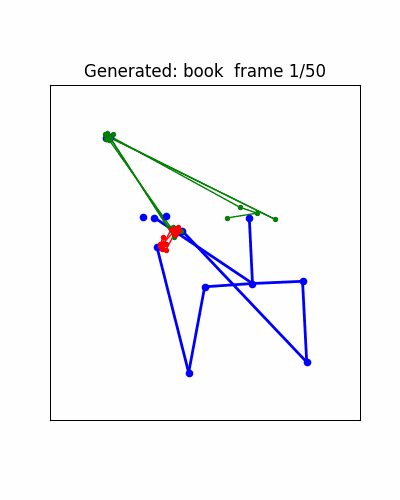

# WLASL Text-to-Pose

ASL үг авч 50 frame-ийн pose sequence (55 keypoint × 2D) үүсгэх Transformer декодер.

## Folder бүтэц

```
wlasl_t2p/
├── src/
│   ├── config.py        # Тохиргоо
│   ├── dataset.py       # WLASL pose JSON унших
│   ├── model.py         # Transformer декодер
│   ├── train.py         # Сургалтын loop
│   ├── inference.py     # Үг → pose
│   └── visualize.py     # Stick figure animation
├── data/                # WLASL_v0.3.json + pose_per_individual_videos/
├── checkpoints/         # best.pt, last.pt
├── outputs/             # Generated GIF/MP4
├── notebook.ipynb       # End-to-end pipeline
└── requirements.txt
```

## Setup

```bash
python -m venv .venv
# Windows: .venv\Scripts\activate
# Linux/Mac: source .venv/bin/activate

pip install -r requirements.txt

# PyTorch CUDA (RTX 4050-д CUDA 12.1):
pip install torch --index-url https://download.pytorch.org/whl/cu121
```

## Дата

`data/` дотор:
- `WLASL_v0.3.json` — WLASL repo-н `start_kit/` хавтсаас
- `pose_per_individual_videos/` — WLASL repo-н `code/TGCN/README.md`-д заасан Google Drive линкээс татаж unzip хийнэ

Эцсийн бүтэц:
```
data/
├── WLASL_v0.3.json
└── pose_per_individual_videos/
    ├── 00335/
    │   ├── image_00001_keypoints.json
    │   └── ...
    └── ...
```

## Ажиллуулах

`notebook.ipynb`-ийг нээгээд cell-үүдийг дараалан гүйцэтгэнэ:

1. Орчин шалгах
2. Дата уншиж шалгах
3. Загвар сургах (~30-60 мин RTX 4050 дээр)
4. Inference + GIF үүсгэх

## Архитектур

- **Input:** word_id (int)
- **Word embedding** → memory (1, 128)
- **Learnable query tokens** (50, 128) + positional encoding
- **TransformerDecoder** × 3 layer (d_model=128, nhead=4)
- **Linear head** → (50, 110)

Loss: MSE + 0.1 × temporal smoothness MSE


~1.2M параметр, 6GB VRAM-д амар багтана.

## Repository

WLASL Text-to-Pose: Sign language production prototype.


demo хувилбар


